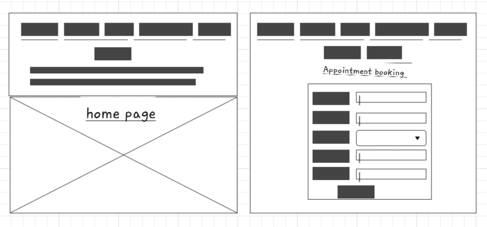
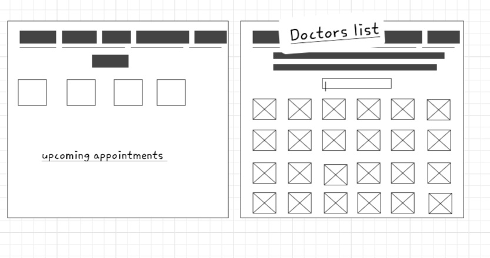

# specialist-clinic-app
## 💻 [Click here](https://specialist-clinic.surge.sh/) to see my live project.

This is a pure front-end app that I have created for my GA final project. This app is created for specialist medical clinic to manage the appoinment bookings.

Some features of the app:
- User-friendly interface that allows easy navigation and interaction. 
- Users able to view a list of doctors along with their specialties. 
- Users able to filter doctors based on specialties. 
- Users able to schedule appointments by filling out a form that captures relevant information. 
- Users able to check upcoming appointments list.

## Wireframe

## 🚀 Cool tech
- Framework: React
- React component library: Material UI/Icons 
- Coding Languages: JavaScript, HTML, CSS
- API: mockapi.io
- Code editor: Visual Studio
- Deployment: Surge

## :bug: Bugs to fix :scream:
- Users shouldn't be able to schedule an appointment if the doctor is not available on the time of choice.

## :sob: Lessons learnt

- How to use API mock data
- Usage of useState and useEffect hooks in react
- Usage of Material UI library
- When debugging, start the process by console logging and do the changes line by line and test them.

## ✅ Future features
- Make the app more responsive to accessed from a desktop, mobile, or any interface.
- Create user accounts for patients, doctors and admin staff.
- Display booked appointments list for each doctor.
